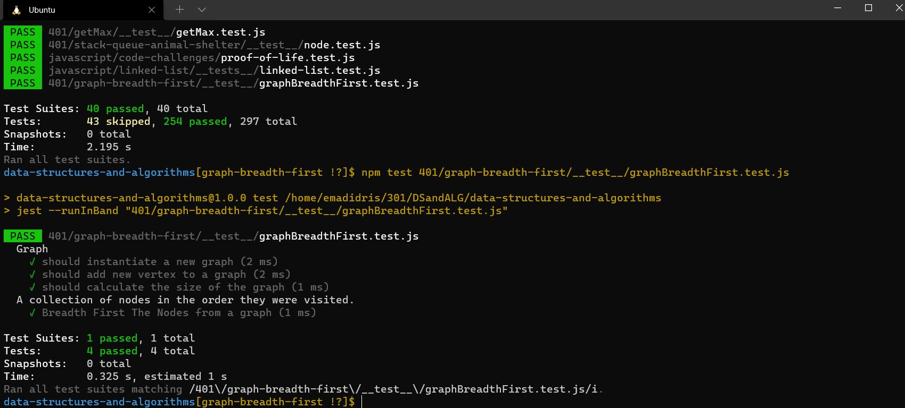

# Code challenge 36:

## Graph-Breadth-First
<!-- Description of the challenge -->
- To write the following method for the Graph class:

  - breadth first
  - Arguments: Node
  - Return: A collection of nodes in the order they were visited.
  - Display the collection

### Approach & Efficiency
<!-- What approach did you take? Discuss Why. What is the Big O space/time for this approach? -->

- test result:

- Big O 
   - Time <--- O(n)
   - Space <----- O(n)
