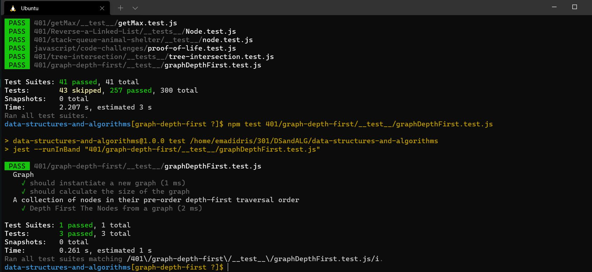

# Code challenge 38:

## Graph-Depth-First
<!-- Description of the challenge -->
- To Write the following method for the Graph class:

   - depth first
   - Arguments: Node (Starting point of search)
   - Return: A collection of nodes in their pre-order depth-first traversal order
   - Display the collection

### Approach & Efficiency
<!-- What approach did you take? Discuss Why. What is the Big O space/time for this approach? -->

- test result:

- Big O 
   - Time <--- O(n)
   - Space <----- O(n)
