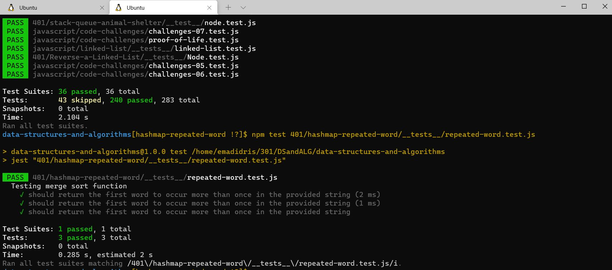

# Challenge Summary
<!-- Short summary or background information -->
Find the first repeated word in a book.

## Challenge Description
<!-- Description of the challenge -->
1. Write a function that accepts a lengthy string parameter.

1. Without utilizing any of the built-in library methods available to your language, return the first word to occur more than once in that provided string.

## Approach & Efficiency
<!-- What approach did you take? Why? What is the Big O space/time for this approach? -->
- Space: O(1)

- Time: O(1)

# Author : Emad Idris ✌✌✌✌✌✌✌✌✌✌✌✌✌

## Hello Teacher Mohamed I'm Emad This is Screen Shot of Test

