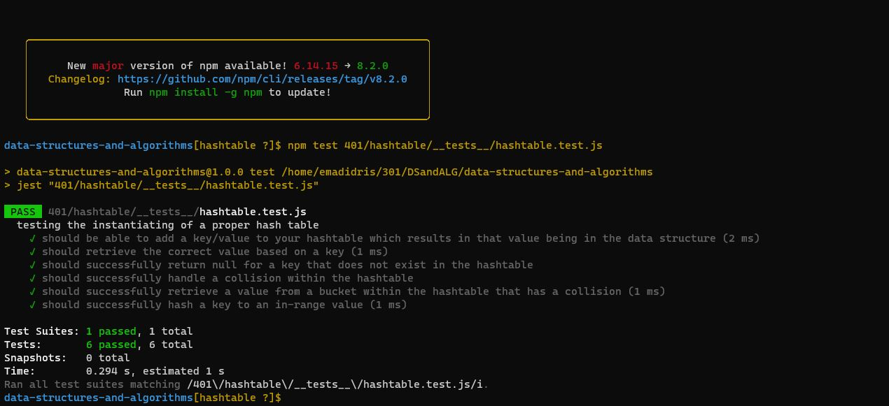

# Challenge Summary
<!-- Short summary or background information -->
Implementation: Hash Tables

## Challenge Description
<!-- Description of the challenge -->
Implement a Hashtable with the following methods:

1. `add:` takes in both the key and value. This method should hash the key, and add the key and value pair to the table, handling collisions as needed.

1. `get:` takes in the key and returns the value from the table.

1. `contains:` takes in the key and returns a boolean, indicating if the key exists in the table already.

1. `hash:` takes in an arbitrary key and returns an index in the collection.

## Approach & Efficiency
<!-- What approach did you take? Why? What is the Big O space/time for this approach? -->
- Space: O(1), Time: O(1) (most things in hashtable are only limited by the linked list or array used as each bucket)

# Author : Emad Idris ✌✌✌✌✌✌✌✌✌✌✌✌✌

## Hello Teacher Mohamed I'm Emad This is Screen Shot of Test

