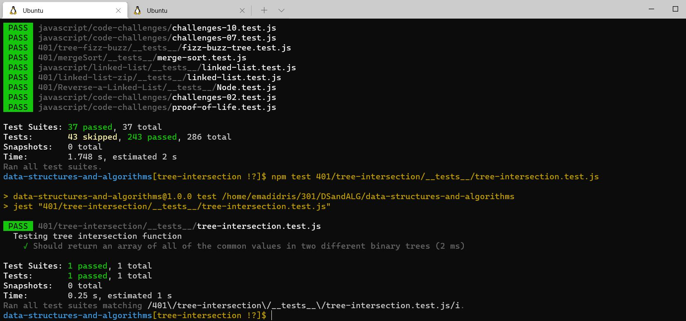

# Challenge Summary
<!-- Short summary or background information -->
Find common values in 2 binary trees.

## Challenge Description
<!-- Description of the challenge -->
1. Write a function called tree_intersection that takes two binary tree parameters.

1. Without utilizing any of the built-in library methods available to your language, return a set of values found in both trees.

## Approach & Efficiency
<!-- What approach did you take? Why? What is the Big O space/time for this approach? -->
- Space: O()

- Time: O()

# Author : Emad Idris ✌✌✌✌✌✌✌✌✌✌✌✌✌

## Hello Teacher Mohamed I'm Emad This is Screen Shot of Test

